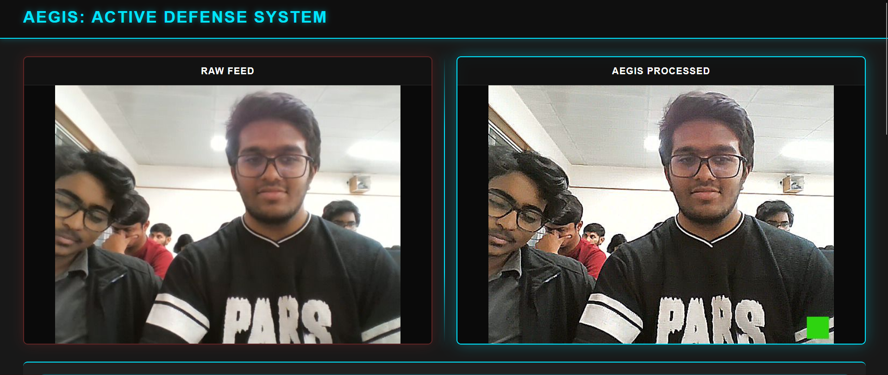
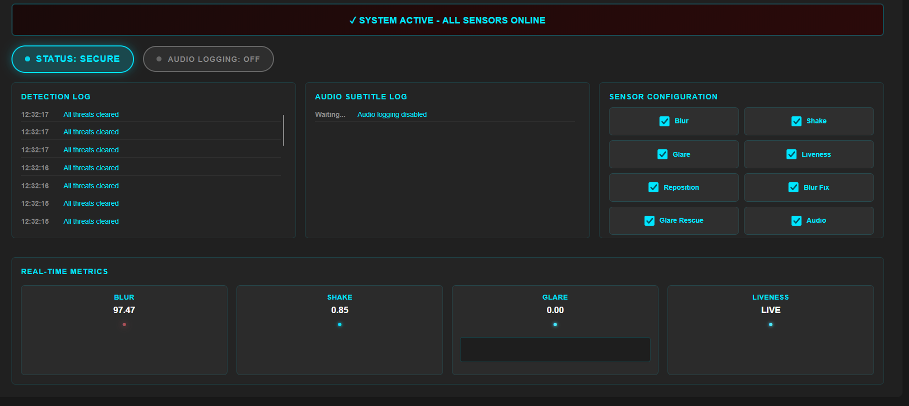

# AegisAI – Tamper-Resistant Surveillance System

AegisAI is a professional-grade, end-to-end surveillance platform that combines real-time **AI-driven tamper detection** with **cryptographic evidence preservation**. It is designed to identify physical attacks (blurring, shaking, repositioning), environmental interference, and digital replay attacks using a hybrid approach of computer vision and robust watermarking.

---

## 🖥️ Frontend Dashboard

The AegisAI dashboard provides real-time visualization of camera feeds, tamper metrics, and incident logs. Users can toggle active defense modules and monitor system health through a sleek, responsive interface.

| Primary Dashboard View | Video Integrity & Analytics |
|:---:|:---:|
|  |  |

---

## 📖 Table of Contents
- [Concept & Threat Model](#-concept--threat-model)
- [Key Features](#-key-features)
- [Visual Showcase](#-visual-showcase)
- [Core Modules & Algorithms](#-core-modules--algorithms)
- [Repository Structure](#-repository-structure)
- [Getting Started](#-getting-started)
- [Testing & Validation](#-testing--validation)
- [Authors & License](#-authors--license)

---

## 🛡️ Concept & Threat Model

Traditional CCTV systems are vulnerable to silent defeat via:
- **Lens Obstruction**: Covering or defocusing the lens.
- **Physical Displacement**: Shaking or re-aiming the camera.
- **Environmental Attacks**: Overpowering the sensor with bright light (glare).
- **Digital Spoofing**: Replaying old footage or freezing the feed.

**AegisAI** addresses these by treating the camera as an actively defended sensor, implementing forensic traceability and cryptographic integrity for every frame captured.

---

## ✨ Key Features

- **Active Tamper Detection**: Real-time identification of blur, shake, and camera repositioning.
- **Glare Rescue**: Recovers detail from overexposed frames (e.g., flashlights) using CLAHE (Contrast Limited Adaptive Histogram Equalization).
- **Cryptographic Integrity**: HMAC-SHA256 watermarking on every frame to prevent replay attacks.
- **Liveness Verification**: Detects frozen or looped feeds using frame-difference statistics.
- **Structured Incident Logging**: SQL-backed database for auditable evidence and historical analytics.
- **Real-time Monitoring**: Socket.IO-powered dashboard with live status updates and alert banners.

---

## 📸 Visual Showcase

### 💡 Glare Rescue Gallery
The system detects overexposure and applies adaptive histogram equalization to recover details like facial features or license plates that would otherwise be lost in harsh glare.

| Glare Detection | Recovery Process | Restored Output |
|:---:|:---:|:---:|
|  |  |  |

---

## 🧠 Core Modules & Algorithms

### 1. Blur Detection & Correction
- **Detection**: Uses the **Laplacian Variance Method** (`∇²I`). Sharp images have high variance (edges); blurred images have low variance.
- **Correction**: Applies an **Unsharp Mask** in real-time to amplify high-frequency details.

### 2. Shake & Reposition Detection
- **Algorithm**: **Farneback Dense Optical Flow**.
- **Shake**: Identifies high-magnitude, oscillatory motion patterns.
- **Repositioning**: Tracks directional consistency over multiple frames. If motion vectors point consistently in one direction (e.g., 90% alignment), a "Camera Moved" alert is triggered.

### 3. Glare Rescue (CLAHE)
- **Method**: Histogram analysis identifies "blown out" highlights.
- **Rescue**: Uses **Contrast Limited Adaptive Histogram Equalization** to locally equalize tiles, recovering features from glare while suppressing noise.

### 4. Cryptographic Watermarking
- **Encoding**: Generates a unique **HMAC-SHA256** token using a secret key and the current Unix timestamp.
- **Embedding**: The token is converted into a color watermark and embedded into the frame ROI.
- **Validation**: Analyzes frame-by-frame tokens; if they don't match the expected HMAC sequence, the video is flagged as a **Replay Attack**.

---

## 📁 Repository Structure

```text
aegisai/
├── app.py                # Main Flask-SocketIO server & entry point
├── backend/              # Core Logic & Algorithms
│   ├── tamper_detector.py # Blur, Shake, Reposition & Liveness logic
│   ├── glare_rescue.py    # Histogram analysis & CLAHE rescue
│   ├── database.py       # SQLite persistence & Incident logging
│   ├── watermark_*.py    # Cryptographic embedding & validation
│   └── pocketsphinx_*.py # Audio recognition integration
├── frontend/             # Real-time Web Dashboard (HTML/JS/CSS)
├── assets/               # Demo samples & Debug images
├── data/                 # Database storage
├── storage/              # Evidence storage (glare images, video clips)
├── tests/                # Comprehensive automated test suite
└── scripts/              # Utility & support scripts
```

---

## 🚀 Getting Started

### 1. Prerequisites
- **Python 3.9+**
- **Webcam** (Default Index: 0)
- **C Toolchain**: Required for OpenCV/scientific libraries.
- **(Optional) Tesseract OCR**: For text-based recognition features.

### 2. Installation
```powershell
# Clone the repository
git clone https://github.com/ZeroDeaths7/AegisAI-tamper-resistent-surveillance-system.git
cd AegisAI-tamper-resistent-surveillance-system

# Set up virtual environment
python -m venv venv
.\venv\Scripts\activate

# Install dependencies
pip install -r requirements.txt
```

### 3. Run the Application
```powershell
python app.py
```
Open **[http://localhost:5000](http://localhost:5000)** in your browser to view the dashboard.

---

## 🧪 Testing & Validation

The repository includes a robust suite of tests to ensure system integrity:
- **API Response Format**: `test_api_response_format.py`
- **Optical Flow & Tamper**: `test_optical_flow.py`, `test_tamper_detector.py`
- **Watermark & Integrity**: `test_watermarker.py`, `test_e2e_validation.py`

Run all tests using:
```bash
pytest
```

---

## 🤝 Authors & License
- **Authors**: Prateek, Mevin, Rajeev, Abhiram
- **License**: This project is licensed under the MIT License - see the [LICENSE](LICENSE) file for details.

---
**Built with ❤️ for secure, auditable environments.**
